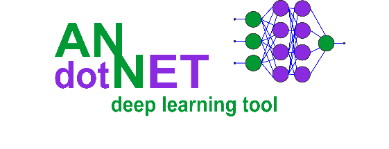

# ANNdotNET v2.0 alpha

ANNdotNET –  is an open source project for deep learning written in C# and supports .NET and .NET Core platform. The main purpose of the project is creating and training deep learning models. One of the main project component is ANNdotNET ML Engine which is based on Tensorflow.Net. The project supposed to be GUI tool for deep learning with data preprocessing, model evaluation, exporting and deploying. 
 
The project is hosted at http://github.com/bhrnjica/anndotnet, and the project documentation can be found at the project wiki pages at https://github.com/bhrnjica/anndotnet/wiki.  

The process of creating, training, evaluating and exporting models is provided from the GUI Application
 and does not require knowledge for supported programming languages. The ANNdotNET is ideal in several scenarios:

- more focus on network development and training process using classic desktop approach, instead of focusing on coding, 
- less time spending on debugging source code, more focusing on different configuration and parameter variants,
- ideal for engineers/users who are not familiar with programming languages, 
- in case the problem requires coding custom models, or training process, ANNdotNET CMD provides high level of API for such implementation,
- all ml configurations developed with GUI tool,can be handled with CMD tool and vice versa.  

There are dozens of pre-calculated projects included in the installer which can be opened from the Start page as well as from CMD tool. The annprojects are
 based on famous datasets from several categories: regression, binary and multi class classification problems, image classifications, times series, etc.
In pre-calculated projects the user can find how to use various neural network configurations e.g. feed forward,
 deep neural network, LSTM recurrent nets, embedding and drop out layers. Also, each project can be modified
 in terms of change its network configuration, learning and training parameters, as well as create new ml configurations.

